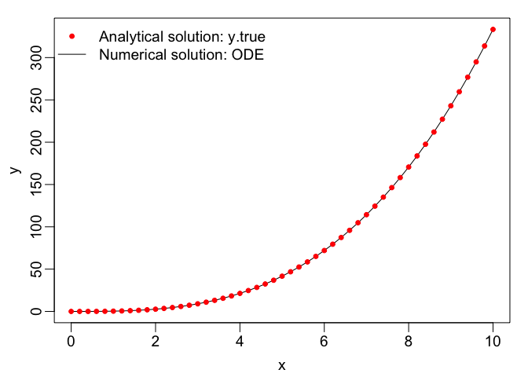
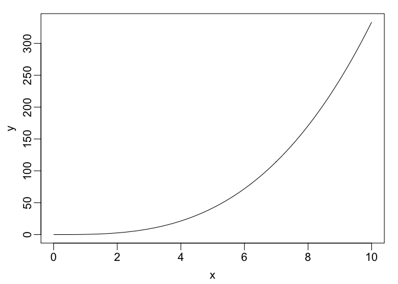
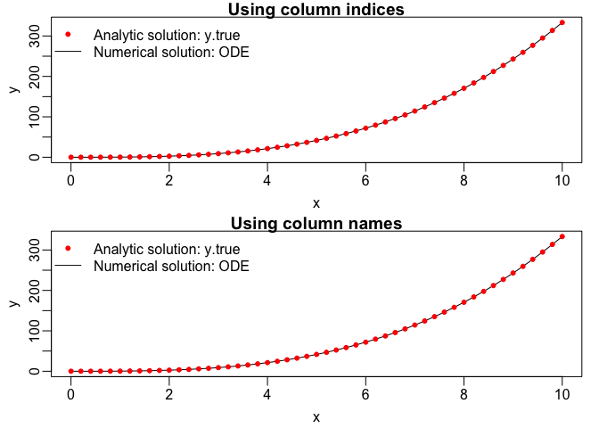
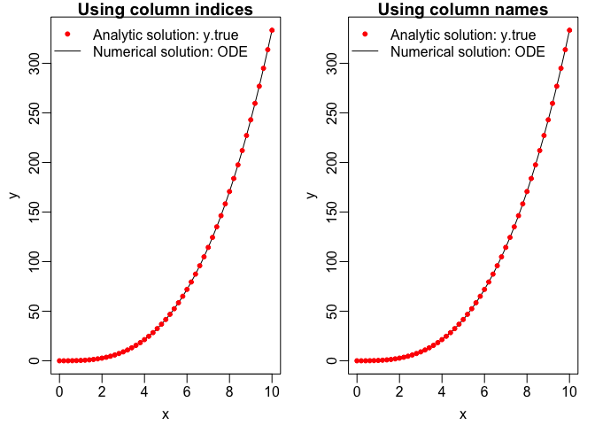

SIR Simulations
================

# Ordinary Differential Equations (ODE)

**General Routine**:  
1. Code the ODE/model (or function here)  
2. Specify the initial conditions/parameters  
3. Call the “ode” function to solve the ODE/model and generate the
simulation  
4. Check/analyze model outputs

## Step 1: Code the ODE Model (or function here)

``` r
myfunc = function(x, y, parms) {
  dy = x^2
  list(dy)
}
```

## Step 2: Specify Initial Conditions/Parameters

``` r
xs = seq(0, 10, by = 0.2) #the 'time' step to integrate upon
state = c (y = 0);
```

## Step 3: Call the ODE Function to Generate the Simulation

``` r
out = ode (y = state, times = xs, func = myfunc, parms = NULL)

#the analytical solution for this problem
y.true = 1/3 * xs^3
```

## Step 4: Check/Analyze Model Outputs

``` r
print(out) # to view the entire output
```

    ##    time            y
    ## 1   0.0 0.000000e+00
    ## 2   0.2 2.667523e-03
    ## 3   0.4 2.133419e-02
    ## 4   0.6 7.200086e-02
    ## 5   0.8 1.706675e-01
    ## 6   1.0 3.333342e-01
    ## 7   1.2 5.760009e-01
    ## 8   1.4 9.146675e-01
    ## 9   1.6 1.365334e+00
    ## 10  1.8 1.944001e+00
    ## 11  2.0 2.666668e+00
    ## 12  2.2 3.549334e+00
    ## 13  2.4 4.608001e+00
    ## 14  2.6 5.858668e+00
    ## 15  2.8 7.317334e+00
    ## 16  3.0 9.000001e+00
    ## 17  3.2 1.092267e+01
    ## 18  3.4 1.310133e+01
    ## 19  3.6 1.555200e+01
    ## 20  3.8 1.829067e+01
    ## 21  4.0 2.133333e+01
    ## 22  4.2 2.469600e+01
    ## 23  4.4 2.839467e+01
    ## 24  4.6 3.244533e+01
    ## 25  4.8 3.686400e+01
    ## 26  5.0 4.166667e+01
    ## 27  5.2 4.686933e+01
    ## 28  5.4 5.248800e+01
    ## 29  5.6 5.853867e+01
    ## 30  5.8 6.503733e+01
    ## 31  6.0 7.200000e+01
    ## 32  6.2 7.944267e+01
    ## 33  6.4 8.738133e+01
    ## 34  6.6 9.583200e+01
    ## 35  6.8 1.048107e+02
    ## 36  7.0 1.143333e+02
    ## 37  7.2 1.244160e+02
    ## 38  7.4 1.350747e+02
    ## 39  7.6 1.463253e+02
    ## 40  7.8 1.581840e+02
    ## 41  8.0 1.706667e+02
    ## 42  8.2 1.837893e+02
    ## 43  8.4 1.975680e+02
    ## 44  8.6 2.120187e+02
    ## 45  8.8 2.271573e+02
    ## 46  9.0 2.430000e+02
    ## 47  9.2 2.595627e+02
    ## 48  9.4 2.768613e+02
    ## 49  9.6 2.949120e+02
    ## 50  9.8 3.137307e+02
    ## 51 10.0 3.333333e+02

``` r
colnames(out) #showing column names so you can refer to them by name
```

    ## [1] "time" "y"

``` r
#plotting to check the ode is working
par(mar = c(3, 3, 1, 1), mgp = c(1.8, 0.5, 0), cex = 1.2)
plot(x = out[, 1], y = out[, 2], xlab = 'x', ylab = 'y', type = 'l')
points(x = xs, y = y.true, col = 'red', pch = 20)
legend('topleft', legend = c('Analytical solution: y.true', 'Numerical solution: ODE'), 
       col = c('red', 'black'), lty = c(NA, 1), pch = c(20, NA), bty = 'n')
```

<!-- -->

``` r
#another method to check the ode is working
plot(x = out[, 'time'], y = out[, 'y'], xlab = 'x', ylab = 'y', type = 'l')
```

<!-- -->

``` r
#side by side comparison
par(mar = c(3, 3, 1, 1), mgp = c(1.8, 0.5, 0), cex = 1.2,
    mfrow = c(2, 1)) 
plot(x = out[, 1], y = out[, 2], xlab = 'x', ylab = 'y', type = 'l', 
     main = "Using column indices")  
points(x = xs, y = y.true, col = 'red', pch = 20)
legend('topleft', legend = c('Analytic solution: y.true', 'Numerical solution: ODE'),
       col = c('red', 'black'), lty = c(NA, 1), pch = c(20, NA), bty = 'n')


plot(x = out[, 'time'], y = out[, 'y'], xlab = 'x', ylab = 'y', type = 'l', 
     main = "Using column names")
points(x = xs, y = y.true, col = 'red', pch = 20)
legend('topleft', legend = c('Analytic solution: y.true', 'Numerical solution: ODE'),
       col = c('red', 'black'), lty = c(NA, 1), pch = c(20, NA), bty = 'n')
```

<!-- -->

``` r
par(mar = c(3, 3, 1, 1), mgp = c(1.8, 0.5, 0), cex = 1.2,
    mfrow = c(1, 2)) 
plot(x = out[, 1], y = out[, 2], xlab = 'x', ylab = 'y', type = 'l', 
     main = "Using column indices")  
points(x = xs, y = y.true, col = 'red', pch = 20)
legend('topleft', legend = c('Analytic solution: y.true', 'Numerical solution: ODE'),
       col = c('red', 'black'), lty = c(NA, 1), pch = c(20, NA), bty = 'n')

plot(x = out[, 'time'], y = out[, 'y'], xlab = 'x', ylab = 'y', type = 'l', 
     main = "Using column names") 
points(x = xs, y = y.true, col = 'red', pch = 20)
legend('topleft', legend = c('Analytic solution: y.true', 'Numerical solution: ODE'),
       col = c('red', 'black'), lty = c(NA, 1), pch = c(20, NA), bty = 'n')
```

<!-- -->

### Exploring the Model

``` r
head(out, 3) #showing the first 3 outputs from the start or 'head' of the data
```

    ##      time           y
    ## [1,]  0.0 0.000000000
    ## [2,]  0.2 0.002667523
    ## [3,]  0.4 0.021334190

``` r
tail(out, 6) # showing the last 6 outputs from the end or 'tail' of the data
```

    ##       time        y
    ## [46,]  9.0 243.0000
    ## [47,]  9.2 259.5627
    ## [48,]  9.4 276.8613
    ## [49,]  9.6 294.9120
    ## [50,]  9.8 313.7307
    ## [51,] 10.0 333.3333

``` r
out[, 2] #the first column of the output by column indexing
```

    ##  [1] 0.000000e+00 2.667523e-03 2.133419e-02 7.200086e-02 1.706675e-01
    ##  [6] 3.333342e-01 5.760009e-01 9.146675e-01 1.365334e+00 1.944001e+00
    ## [11] 2.666668e+00 3.549334e+00 4.608001e+00 5.858668e+00 7.317334e+00
    ## [16] 9.000001e+00 1.092267e+01 1.310133e+01 1.555200e+01 1.829067e+01
    ## [21] 2.133333e+01 2.469600e+01 2.839467e+01 3.244533e+01 3.686400e+01
    ## [26] 4.166667e+01 4.686933e+01 5.248800e+01 5.853867e+01 6.503733e+01
    ## [31] 7.200000e+01 7.944267e+01 8.738133e+01 9.583200e+01 1.048107e+02
    ## [36] 1.143333e+02 1.244160e+02 1.350747e+02 1.463253e+02 1.581840e+02
    ## [41] 1.706667e+02 1.837893e+02 1.975680e+02 2.120187e+02 2.271573e+02
    ## [46] 2.430000e+02 2.595627e+02 2.768613e+02 2.949120e+02 3.137307e+02
    ## [51] 3.333333e+02

``` r
out[, 'y'] #the first column of the output by column name
```

    ##  [1] 0.000000e+00 2.667523e-03 2.133419e-02 7.200086e-02 1.706675e-01
    ##  [6] 3.333342e-01 5.760009e-01 9.146675e-01 1.365334e+00 1.944001e+00
    ## [11] 2.666668e+00 3.549334e+00 4.608001e+00 5.858668e+00 7.317334e+00
    ## [16] 9.000001e+00 1.092267e+01 1.310133e+01 1.555200e+01 1.829067e+01
    ## [21] 2.133333e+01 2.469600e+01 2.839467e+01 3.244533e+01 3.686400e+01
    ## [26] 4.166667e+01 4.686933e+01 5.248800e+01 5.853867e+01 6.503733e+01
    ## [31] 7.200000e+01 7.944267e+01 8.738133e+01 9.583200e+01 1.048107e+02
    ## [36] 1.143333e+02 1.244160e+02 1.350747e+02 1.463253e+02 1.581840e+02
    ## [41] 1.706667e+02 1.837893e+02 1.975680e+02 2.120187e+02 2.271573e+02
    ## [46] 2.430000e+02 2.595627e+02 2.768613e+02 2.949120e+02 3.137307e+02
    ## [51] 3.333333e+02

``` r
out[3, ] #printing the 3rd row
```

    ##       time          y 
    ## 0.40000000 0.02133419

# Simulation Using the SIR Model

## Step 1: Code the SIR Model (or function here)

``` r
SIR = function (t, state, parameters) {
  with(as.list(c(state, parameters)), {
    dS = -beta * S * (I/N); #rate of change of susceptible population
    dI = beta * S * (I/N) - gamma * I; #rate of change of infectious population
    
    dcumI = beta * S * (I/N) #computing the cumulative number of infections
    
    list(c(dS, dI, dcumI)) #returning the rate of change
  })
}
```

## Step 2: Specify Initial Conditions/Parameters

``` r
N = 1e5 #population size or number of people in the population
I0 = 10 #initial number of infectious peolpe
S0 = N - I0 #intial number of susceptible people
state = c(S = S0, I = I0, cumI = I0) #storing the initial conditions I and S together
parameters = c(beta = 0.5, gamma = 0.3) #storing the model parameters, unit: per day

times = seq(1, 100, by = 1) # setting simulation time steps: 1 to 100 days
```

## Step 3: Call the ‘ode’ function to Generate the Simulation

``` r
sim = ode(y = state, times = times, func = SIR, parms = parameters)
```
